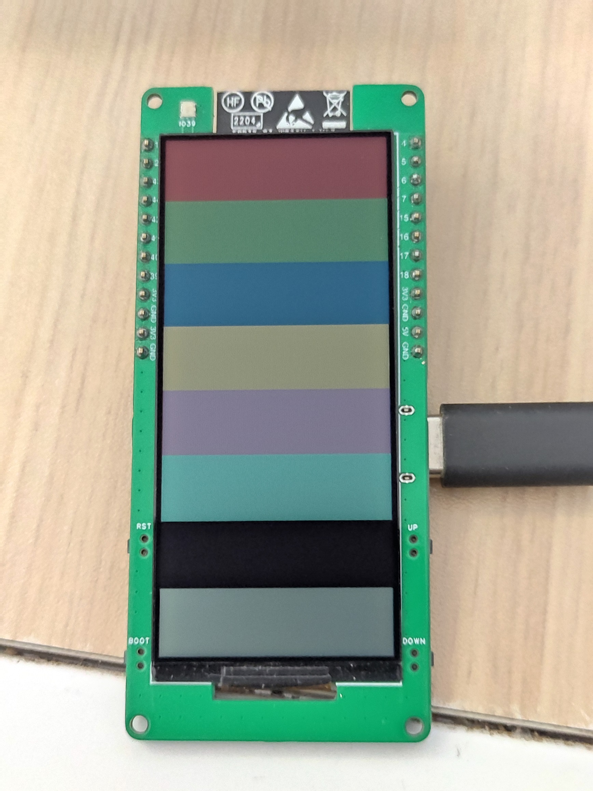
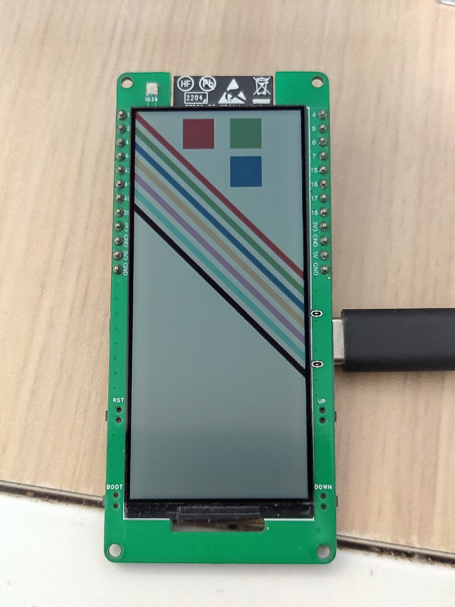

esp32 S7306 驱动 

使用TE引脚中断刷屏，直接在头文件里面修改相应引脚

示例代码：

```c++
#include "ST7306_LCD.h"
#define display st7306Lcd

uint16_t red = 0b11111 << 11;
uint16_t green = 0b111111 << 5;
uint16_t blue = 0b11111;
uint16_t yellow = red | green;
uint16_t purple = red | blue;
uint16_t cyan = green | blue;

uint16_t colorList[8] = {
    red,//红
    green,//绿
    blue,//蓝
    yellow,//黄
    purple,//紫
    cyan,//青
    0x0000,//黑
    0xFFFF,//白
};

void repeat_draw_line(uint16_t x, uint16_t y, uint16_t color, uint8_t lineNum) {
    for (int i = 0; i < lineNum; i++) {
        display.drawPixel(x, y + i, color);
    }
}

void st7306_test1() {
//    绘制几个矩形
    for (int y = 10; y < 50; y++) {
        for (int x = 60; x < 100; x++) {
            display.drawPixel(x, y, colorList[0]);
        }
    }
    
    for (int y = 10; y < 50; y++) {
        for (int x = 120; x < 160; x++) {
            display.drawPixel(x, y, colorList[1]);
        }
    }
    
    for (int y = 60; y < 100; y++) {
        for (int x = 120; x < 160; x++) {
            display.drawPixel(x, y, colorList[2]);
        }
    }
    
    //绘制几条斜线
    for (int y = 0; y < display.height(); y++) {
        for (int x = 0; x < display.width(); x++) {
            if (x == y) {
                repeat_draw_line(x,y,colorList[0],10);
            }
            if (x == y - 20) {
                repeat_draw_line(x,y,colorList[1],10);
            }
            if (x == y - 40) {
                repeat_draw_line(x,y,colorList[2],10);
            }
            if (x == y - 60) {
                repeat_draw_line(x,y,colorList[3],10);
            }
            if (x == y - 80) {
                repeat_draw_line(x,y,colorList[4],10);
            }
            if (x == y - 100) {
                repeat_draw_line(x,y,colorList[5],10);
            }
            if (x == y - 120) {
                repeat_draw_line(x,y,colorList[6],10);
            }
            if (x == y - 140) {
                repeat_draw_line(x,y,colorList[7],10);
            }
        }
    }
    display.refreshReal();
}

void st7306_test() {
    //画点函数刷屏测试
    uint32_t t1 = esp_timer_get_time();
    
    for (int y = 0; y < display.height(); y++) {
        uint8_t colorIndex = y / 60;
        for (int x = 0; x < display.width(); x++) {
            display.drawPixel(x, y, colorList[colorIndex]);
        }
    }
    
    uint32_t t2 = esp_timer_get_time();
    display.refreshReal();
    uint32_t t3 = esp_timer_get_time();
    printf("drawPixel fillScreen cost %lu us refresh cost %lu us\n", t2 - t1, t3 - t2);
    vTaskDelay(500);
    
    //高性能刷屏函数测试
    for (int i = 0; i < 8; i++) {
        display.fillScreen(colorList[i]);
        vTaskDelay(200);
    }
    
    display.refreshReal();
    vTaskDelay(500);
}
  
    display.begin();
    st7306_test();
    st7306_test1();
```

lvgl v8 刷屏函数
```c++

static void disp_flush(lv_disp_drv_t *disp_drv, const lv_area_t *area, lv_color_t *color_p) {
    int16_t x, y;
    uint16_t *colorPtr = (uint16_t *) color_p;
    
    for (y = area->y1; y <= area->y2; y++) {
        for (x = area->x1; x <= area->x2; x++) {
            display.drawPixel(x, y, *colorPtr);
            colorPtr++;
        }
    }
    display.refresh();
    
    lv_disp_flush_ready(disp_drv);
}

```

显示效果



